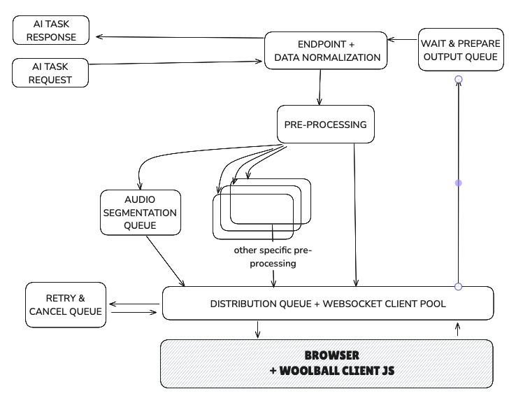

# 🧶 Woolball Server

<div align="center">

[](https://open.woolball.xyz)
[](https://discord.gg/xbSmMfmwWW)
[](LICENSE)
[](https://github.com/orgs/woolball-xyz/packages)
[](https://sonarcloud.io/summary/new_code?id=woolball-xyz_browser-network-server)

**Transform idle browsers into a powerful distributed AI inference network**

*Your own browser-based inference infrastructure by turning idle browsers into compute nodes*

[🚀 Quick Start](#-quick-start) • [📖 API Reference](#-api-reference) • [🛠️ Development](#-local-development) • [💬 Discord](https://discord.gg/xbSmMfmwWW)

</div>

---

## ✨ What is Woolball?

Woolball Server is an **open-source network server** that orchestrates AI inference jobs across a distributed network of browser-based compute nodes. Instead of relying on expensive cloud infrastructure, harness the collective power of idle browsers to run AI models efficiently and cost-effectively.

> 🔗 **Client side**: Available in [`woolball-client`](https://github.com/woolball-xyz/woolball-client)  
> 📋 **Roadmap**: Check our [next steps](https://github.com/woolball-xyz/woolball-server/issues)

---

## 🎯 Supported AI Tasks

<table>
<thead>
<tr>
<th>🔧 Provider</th>
<th>🎯 Task</th>
<th>🤖 Models</th>
<th>📊 Status</th>
</tr>
</thead>
<tbody>
<tr>
<td><strong><a href="https://github.com/huggingface/transformers.js">Transformers.js</a></strong></td>
<td>🎤 Speech-to-Text</td>
<td><a href="https://huggingface.co/models?pipeline_tag=automatic-speech-recognition&library=transformers.js&sort=trending">ONNX Models</a></td>
<td>✅ Ready</td>
</tr>
<tr>
<td><strong><a href="https://github.com/huggingface/transformers.js">Transformers.js</a></strong></td>
<td>🔊 Text-to-Speech</td>
<td><a href="https://huggingface.co/models?pipeline_tag=text-to-speech&library=transformers.js&sort=trending&search=mms">ONNX Models</a></td>
<td>✅ Ready</td>
</tr>
<tr>
<td><strong><a href="https://github.com/hexgrad/kokoro">Kokoro.js</a></strong></td>
<td>🔊 Text-to-Speech</td>
<td><a href="https://huggingface.co/onnx-community/Kokoro-82M-v1.0-ONNX">ONNX Models</a></td>
<td>✅ Ready</td>
</tr>
<tr>
<td><strong><a href="https://github.com/huggingface/transformers.js">Transformers.js</a></strong></td>
<td>🌐 Translation</td>
<td><a href="https://huggingface.co/models?pipeline_tag=translation&library=transformers.js&sort=trending">ONNX Models</a></td>
<td>✅ Ready</td>
</tr>
<tr>
<td><strong><a href="https://github.com/huggingface/transformers.js">Transformers.js</a></strong></td>
<td>📝 Text Generation</td>
<td><a href="https://huggingface.co/models?pipeline_tag=text-generation&library=transformers.js&sort=trending">ONNX Models</a></td>
<td>✅ Ready</td>
</tr>
<tr>
<td><strong><a href="https://github.com/mlc-ai/web-llm">WebLLM</a></strong></td>
<td>📝 Text Generation</td>
<td><a href="https://mlc.ai/models">MLC Models</a></td>
<td>✅ Ready</td>
</tr>
<tr>
<td><strong><a href="https://ai.google.dev/edge/mediapipe/solutions/guide">MediaPipe</a></strong></td>
<td>📝 Text Generation</td>
<td><a href="https://ai.google.dev/edge/mediapipe/solutions/genai/llm_inference#models">LiteRT Models</a></td>
<td>✅ Ready</td>
</tr>
</tbody>
</table>

---

## 🚀 Quick Start

Get up and running in under 2 minutes:

### 1️⃣ Clone & Deploy
```bash
git clone --branch deploy --single-branch --depth 1 https://github.com/woolball-xyz/woolball-server.git
cd woolball-server && docker compose up -d
```

### 2️⃣ Verify Setup
Open [http://localhost:9000](http://localhost:9000) to ensure at least one client node is connected.

### 3️⃣ Start Using the API
```bash
curl -X POST http://localhost:9002/api/v1/text-generation \
  -F 'input=[{"role":"user","content":"Hello! Can you explain what Woolball is?"}]' \
  -F "model=https://woolball.sfo3.cdn.digitaloceanspaces.com/gemma3-1b-it-int4.task" \
  -F "provider=mediapipe" \
  -F "maxTokens=200"
```

---

## 📖 API Reference

### 📖 Text Generation

<details>
<summary><strong>Generate text with powerful language models</strong></summary>

#### 🤗 Transformers.js Provider

**🤖 Available Models**

| Model | Quantization | Description |
|-------|--------------|-------------|
| `HuggingFaceTB/SmolLM2-135M-Instruct` | `fp16` | Compact model for basic text generation |
| `HuggingFaceTB/SmolLM2-360M-Instruct` | `q4` | Balanced performance and size |
| `Mozilla/Qwen2.5-0.5B-Instruct` | `q4` | Efficient model for general tasks |
| `onnx-community/Qwen2.5-Coder-0.5B-Instruct` | `q8` | Specialized for code generation |

#### 💡 Example Usage

```bash
curl -X POST http://localhost:9002/api/v1/text-generation \
  -F 'input=[{"role":"system","content":"You are a helpful assistant."},{"role":"user","content":"What is the capital of Brazil?"}]' \
  -F "model=HuggingFaceTB/SmolLM2-135M-Instruct" \
  -F "dtype=fp16" \
  -F "max_new_tokens=250" \
  -F "temperature=0.7" \
  -F "do_sample=true"
```

#### ⚙️ Parameters

| Parameter | Type | Default | Description |
|-----------|------|---------|-------------|
| `model` | string | - | 🤖 Model ID (e.g., "HuggingFaceTB/SmolLM2-135M-Instruct") |
| `dtype` | string | - | 🔧 Quantization level (e.g., "fp16", "q4") |
| `max_length` | number | 20 | 📏 Maximum length the generated tokens can have (includes input prompt) |
| `max_new_tokens` | number | null | 🆕 Maximum number of tokens to generate, ignoring prompt length |
| `min_length` | number | 0 | 📐 Minimum length of the sequence to be generated (includes input prompt) |
| `min_new_tokens` | number | null | 🔢 Minimum numbers of tokens to generate, ignoring prompt length |
| `do_sample` | boolean | false | 🎲 Whether to use sampling; use greedy decoding otherwise |
| `num_beams` | number | 1 | 🔍 Number of beams for beam search. 1 means no beam search |
| `temperature` | number | 1.0 | 🌡️ Value used to modulate the next token probabilities |
| `top_k` | number | 50 | 🔝 Number of highest probability vocabulary tokens to keep for top-k-filtering |
| `top_p` | number | 1.0 | 📊 If < 1, only tokens with probabilities adding up to top_p or higher are kept |
| `repetition_penalty` | number | 1.0 | 🔄 Parameter for repetition penalty. 1.0 means no penalty |
| `no_repeat_ngram_size` | number | 0 | 🚫 If > 0, all ngrams of that size can only occur once |

---

#### 🤖 WebLLM Provider

**🤖 Available Models**

| Model | Description |
|-------|-------------|
| `DeepSeek-R1-Distill-Qwen-7B-q4f16_1-MLC` | DeepSeek R1 distilled model with reasoning capabilities |
| `DeepSeek-R1-Distill-Llama-8B-q4f16_1-MLC` | DeepSeek R1 distilled Llama-based model |
| `SmolLM2-1.7B-Instruct-q4f32_1-MLC` | Compact instruction-following model |
| `Llama-3.1-8B-Instruct-q4f32_1-MLC` | Meta's Llama 3.1 8B instruction model |
| `Qwen3-8B-q4f32_1-MLC` | Alibaba's Qwen3 8B model |

#### 💡 Example Usage

```bash
curl -X POST http://localhost:9002/api/v1/text-generation \
  -F 'input=[{"role":"system","content":"You are a helpful assistant."},{"role":"user","content":"What is the capital of Brazil?"}]' \
  -F "model=DeepSeek-R1-Distill-Qwen-7B-q4f16_1-MLC" \
  -F "provider=webllm" \
  -F "temperature=0.7" \
  -F "top_p=0.95"
```

#### ⚙️ Parameters

| Parameter | Type | Description |
|-----------|------|-------------|
| `model` | string | 🤖 Model ID from MLC (e.g., "DeepSeek-R1-Distill-Qwen-7B-q4f16_1-MLC") |
| `provider` | string | 🔧 Must be set to "webllm" when using WebLLM models |
| `context_window_size` | number | 🪟 Size of the context window for the model |
| `sliding_window_size` | number | 🔄 Size of the sliding window for attention |
| `attention_sink_size` | number | 🎯 Size of the attention sink |
| `repetition_penalty` | number | 🔄 Penalty for repeating tokens |
| `frequency_penalty` | number | 📊 Penalty for token frequency |
| `presence_penalty` | number | 👁️ Penalty for token presence |
| `top_p` | number | 📈 If < 1, only tokens with probabilities adding up to top_p or higher are kept |
| `temperature` | number | 🌡️ Value used to modulate the next token probabilities |
| `bos_token_id` | number | 🏁 Beginning of sequence token ID (optional) |

---

#### 📱 MediaPipe Provider

**🤖 Available Models**

| Model | Device Type | Description |
|-------|-------------|-------------|
| `https://woolball.sfo3.cdn.digitaloceanspaces.com/gemma2-2b-it-cpu-int8.task` | CPU | Gemma2 2B model optimized for CPU inference |
| `https://woolball.sfo3.cdn.digitaloceanspaces.com/gemma2-2b-it-gpu-int8.bin` | GPU | Gemma2 2B model optimized for GPU inference |
| `https://woolball.sfo3.cdn.digitaloceanspaces.com/gemma3-1b-it-int4.task` | CPU/GPU | Gemma3 1B model with INT4 quantization |
| `https://woolball.sfo3.cdn.digitaloceanspaces.com/gemma3-4b-it-int4-web.task` | Web | Gemma3 4B model optimized for web deployment |

#### 💡 Example Usage

```bash
curl -X POST http://localhost:9002/api/v1/text-generation \
  -F 'input=[{"role":"system","content":"You are a helpful assistant."},{"role":"user","content":"Explain quantum computing in simple terms."}]' \
  -F "model=https://woolball.sfo3.cdn.digitaloceanspaces.com/gemma3-1b-it-int4.task" \
  -F "provider=mediapipe" \
  -F "maxTokens=500" \
  -F "temperature=0.7" \
  -F "topK=40" \
  -F "randomSeed=12345"
```

#### ⚙️ Parameters

| Parameter | Type | Description |
|-----------|------|-------------|
| `model` | string | 🤖 Model ID for MediaPipe LiteRT models on DigitalOcean Spaces |
| `provider` | string | 🔧 Must be set to "mediapipe" when using MediaPipe models |
| `maxTokens` | number | 🔢 Maximum number of tokens to generate |
| `randomSeed` | number | 🎲 Random seed for reproducible results |
| `topK` | number | 🔝 Number of highest probability vocabulary tokens to keep for top-k-filtering |
| `temperature` | number | 🌡️ Value used to modulate the next token probabilities |

</details>

### 🎤 Speech Recognition

<details>
<summary><strong>Convert audio to text with Whisper models</strong></summary>

#### 🤖 Available Models

| Model | Quantization | Description |
|-------|--------------|-------------|
| `onnx-community/whisper-large-v3-turbo_timestamped` | `q4` | 🎯 High accuracy with timestamps |
| `onnx-community/whisper-small` | `q4` | ⚡ Fast processing |

#### 💡 Example Usage

```bash
# 📁 Local file
curl -X POST http://localhost:9002/api/v1/speech-recognition \
  -F "input=@/path/to/your/file.mp3" \
  -F "model=onnx-community/whisper-large-v3-turbo_timestamped" \
  -F "dtype=q4" \
  -F "language=en" \
  -F "return_timestamps=true" \
  -F "stream=false"

# 🔗 URL
curl -X POST http://localhost:9002/api/v1/speech-recognition \
  -F "input=https://example.com/audio.mp3" \
  -F "model=onnx-community/whisper-large-v3-turbo_timestamped" \
  -F "dtype=q4" \
  -F "language=en" \
  -F "return_timestamps=true" \
  -F "stream=false"

# 📊 Base64
curl -X POST http://localhost:9002/api/v1/speech-recognition \
  -F "input=data:audio/mp3;base64,YOUR_BASE64_ENCODED_AUDIO" \
  -F "model=onnx-community/whisper-large-v3-turbo_timestamped" \
  -F "dtype=q4" \
  -F "language=en" \
  -F "return_timestamps=true" \
  -F "stream=false"
```

#### ⚙️ Parameters

| Parameter | Type | Description |
|-----------|------|-------------|
| `model` | string | 🤖 Model ID from Hugging Face (e.g., "onnx-community/whisper-large-v3-turbo_timestamped") |
| `dtype` | string | 🔧 Quantization level (e.g., "q4") |
| `return_timestamps` | boolean \| 'word' | ⏰ Return timestamps ("word" for word-level). Default is `false`. |
| `stream` | boolean | 📡 Stream results in real-time. Default is `false`. |
| `chunk_length_s` | number | 📏 Length of audio chunks to process in seconds. Default is `0` (no chunking). |
| `stride_length_s` | number | 🔄 Length of overlap between consecutive audio chunks in seconds. If not provided, defaults to `chunk_length_s / 6`. |
| `force_full_sequences` | boolean | 🎯 Whether to force outputting full sequences or not. Default is `false`. |
| `language` | string | 🌍 Source language (auto-detect if null). Use this to potentially improve performance if the source language is known. |
| `task` | null \| 'transcribe' \| 'translate' | 🎯 The task to perform. Default is `null`, meaning it should be auto-detected. |
| `num_frames` | number | 🎬 The number of frames in the input audio. |

</details>

### 🔊 Text-to-Speech

<details>
<summary><strong>Generate natural speech from text</strong></summary>

#### 🤗 Transformers.js (MMS Models)

**🤖 Available Models**

| Language | Model | Flag |
|----------|-------|------|
| English | `Xenova/mms-tts-eng` | 🇺🇸 |
| Spanish | `Xenova/mms-tts-spa` | 🇪🇸 |
| French | `Xenova/mms-tts-fra` | 🇫🇷 |
| German | `Xenova/mms-tts-deu` | 🇩🇪 |
| Portuguese | `Xenova/mms-tts-por` | 🇵🇹 |
| Russian | `Xenova/mms-tts-rus` | 🇷🇺 |
| Arabic | `Xenova/mms-tts-ara` | 🇸🇦 |
| Korean | `Xenova/mms-tts-kor` | 🇰🇷 |

#### 💡 Example Usage

```bash
# Standard request
curl -X POST http://localhost:9002/api/v1/text-to-speech \
  -F "input=Hello, this is a test for text to speech." \
  -F "model=Xenova/mms-tts-eng" \
  -F "dtype=q8" \
  -F "stream=false"

# Streaming request
curl -X POST http://localhost:9002/api/v1/text-to-speech \
  -F "input=Hello, this is a test for streaming text to speech." \
  -F "model=Xenova/mms-tts-eng" \
  -F "dtype=q8" \
  -F "stream=true"
```

#### ⚙️ Parameters

| Parameter | Type | Description | Required For |
|-----------|------|-------------|--------------|
| `model` | string | 🤖 Model ID | All providers |
| `dtype` | string | 🔧 Quantization level (e.g., "q8") | All providers |
| `stream` | boolean | 📡 Whether to stream the audio response. Default is `false`. | All providers |

---

#### 🐱 Kokoro (Premium Voices)

**🤖 Available Models**

| Model | Quantization | Description |
|-------|--------------|-------------|
| `onnx-community/Kokoro-82M-ONNX` | `q8` | High-quality English TTS with multiple voices |
| `onnx-community/Kokoro-82M-v1.0-ONNX` | `q8` | Alternative Kokoro model version |

#### 💡 Example Usage

```bash
# Standard request
curl -X POST http://localhost:9002/api/v1/text-to-speech \
  -F "input=Hello, this is a test using Kokoro voices." \
  -F "model=onnx-community/Kokoro-82M-ONNX" \
  -F "voice=af_nova" \
  -F "dtype=q8" \
  -F "stream=false"

# Streaming request
curl -X POST http://localhost:9002/api/v1/text-to-speech \
  -F "input=Hello, this is a test using Kokoro voices with streaming." \
  -F "model=onnx-community/Kokoro-82M-ONNX" \
  -F "voice=af_nova" \
  -F "dtype=q8" \
  -F "stream=true"
```

#### ⚙️ Parameters

| Parameter | Type | Description | Required For |
|-----------|------|-------------|--------------|
| `model` | string | 🤖 Model ID | Required |
| `dtype` | string | 🔧 Quantization level (e.g., "q8") | Required |
| `voice` | string | 🎭 Voice ID (see below) | Required |
| `stream` | boolean | 📡 Whether to stream the audio response. Default is `false`. | Optional |

**🎭 Available Voice Options**

**🇺🇸 American Voices**
- 👩 **Female**: `af_heart`, `af_alloy`, `af_aoede`, `af_bella`, `af_jessica`, `af_nova`, `af_sarah`
- 👨 **Male**: `am_adam`, `am_echo`, `am_eric`, `am_liam`, `am_michael`, `am_onyx`

**🇬🇧 British Voices**
- 👩 **Female**: `bf_emma`, `bf_isabella`, `bf_alice`, `bf_lily`
- 👨 **Male**: `bm_george`, `bm_lewis`, `bm_daniel`, `bm_fable`

</details>

### 🌐 Translation

<details>
<summary><strong>Translate between 200+ languages</strong></summary>

#### 🤖 Available Models

| Model | Quantization | Description |
|-------|--------------|-------------|
| `Xenova/nllb-200-distilled-600M` | `q8` | 🌍 Multilingual translation model supporting 200+ languages |

#### 💡 Example Usage

```bash
curl -X POST http://localhost:9002/api/v1/translation \
  -F "input=Hello, how are you today?" \
  -F "model=Xenova/nllb-200-distilled-600M" \
  -F "dtype=q8" \
  -F "srcLang=eng_Latn" \
  -F "tgtLang=por_Latn"
```

#### 🌍 Language Support
Uses [FLORES200 format](https://github.com/facebookresearch/flores/blob/main/flores200/README.md#languages-in-flores-200) - supports 200+ languages!

#### ⚙️ Parameters

| Parameter | Type | Description |
|-----------|------|-------------|
| `model` | string | 🤖 Model ID (e.g., "Xenova/nllb-200-distilled-600M") |
| `dtype` | string | 🔧 Quantization level (e.g., "q8") |
| `srcLang` | string | 🌍 Source language code in FLORES200 format (e.g., "eng_Latn") |
| `tgtLang` | string | 🌍 Target language code in FLORES200 format (e.g., "por_Latn") |

</details>

---

## 🛠️ Local Development

### 🐳 Docker Setup (Recommended)

```bash
git clone https://github.com/woolball-xyz/woolball-server.git
cd woolball-server && docker compose up --build -d
```

### 🌐 Service Endpoints

| 🔧 Service | 🚪 Port | 🔗 URL |
|------------|---------|--------|
| 🔌 WebSocket | 9003 | [localhost:9003](http://localhost:9003) |
| 🌐 API Server | 9002 | [localhost:9002](http://localhost:9002) |
| 👥 Client Demo | 9000 | [localhost:9000](http://localhost:9000) |

### 🔄 Network Flow



---

## 🤝 Contributing

We welcome contributions! Here's how you can help:

- 🐛 **Report bugs** via [GitHub Issues](https://github.com/woolball-xyz/woolball-server/issues)
- 💡 **Suggest features** in our [Discord](https://discord.gg/xbSmMfmwWW)
- 🔧 **Submit PRs** for improvements
- 📖 **Improve documentation**

---

## 📄 License

This project is licensed under the  AGPL-3.0 License - see the [LICENSE](LICENSE) file for details.

---

<div align="center">

**Made with ❤️ by the Woolball team**

[🌟 Star us on GitHub](https://github.com/woolball-xyz/woolball-server) • [💬 Join Discord](https://discord.gg/xbSmMfmwWW)

</div>