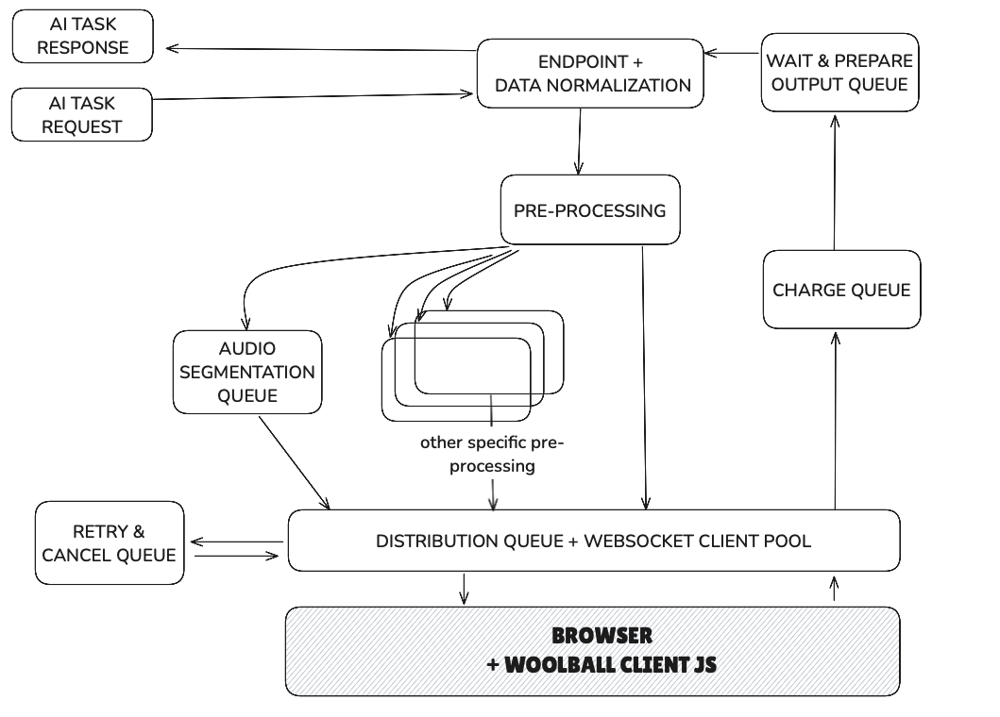

# WoolBall Browser Network Server

## How to use

### Prerequisites

Before running the demo application, you need to build the `browser-node` package and the speech-to-text worker:

```bash
    docker compose up -d
```

This will start an HTTP server on port 9002 and a WebSocket server on port 9003.

For both to work, the server must be running:

https://github.com/woolball-xyz/browser-node



